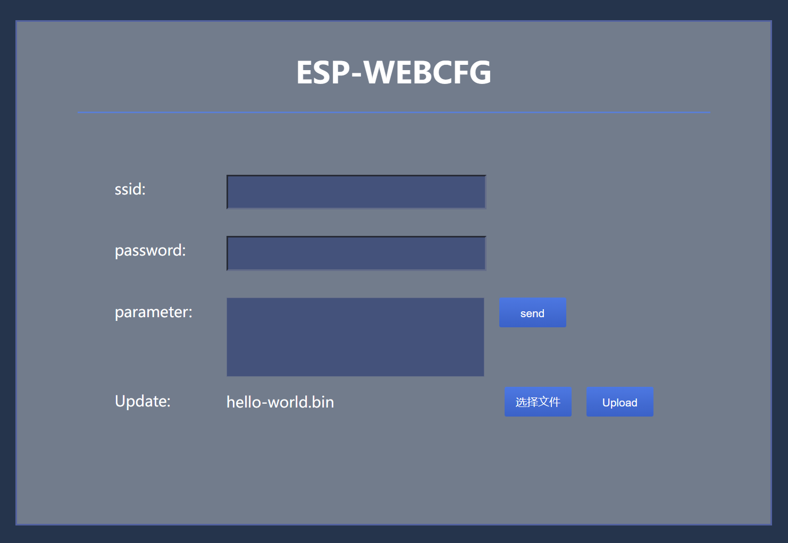

# esp_webcfg
## 简介
esp_webcfg是一个以AP+HTTP服务器为基础的内置网页配网组件，通过在应用中引用组件与调用接口可以快速方便的实现设备网络配置，参数设置与固件更新功能。
## 事件
|  事件   | 含义  |
|  :----:  | :----:  |
| ESP_WEBCFG_START  | 初始化完成 |
| ESP_WEBCFG_SENDINDEX  | 连接配置页面 |
| ESP_WEBCFG_UPDATE  | 网页固件升级 |
| ESP_WEBCFG_ONPARA  | 网页参数设置 |
| ESP_WEBCFG_STOP  | 组件停止 |
## 使用方法
1. 将` components->esp_webcfg`下载并放置与本地开发` ./esp-idf/components`目录下。

2. 下载`example`，用vscode打开（默认配置Espressif IDF环境）
```json
/* 参考c_cpp_properties.json */
{
    "configurations": [
        {
            "name": "ESP-IDF",
            "compilerPath": "g:\\esp-tools\\tools\\xtensa-esp32-elf\\esp-2021r2-patch3-8.4.0\\xtensa-esp32-elf\\bin\\xtensa-esp32-elf-gcc.exe",
            "includePath": [
                "${config:idf.espIdfPath}/components/**",
                "${config:idf.espIdfPathWin}/components/**",
                "${config:idf.espAdfPath}/components/**",
                "${config:idf.espAdfPathWin}/components/**",
                "${workspaceFolder}/**"
            ],
            "browse": {
                "path": [
                    "${config:idf.espIdfPath}/components",
                    "${config:idf.espIdfPathWin}/components",
                    "${config:idf.espAdfPath}/components/**",
                    "${config:idf.espAdfPathWin}/components/**",
                    "${workspaceFolder}"
                ],
                "limitSymbolsToIncludedHeaders": false
            }
        }
    ],
    "version": 4
}
```
## 测试
1. Log
```
I (0) cpu_start: App cpu up.
I (381) cpu_start: Pro cpu start user code
I (381) cpu_start: cpu freq: 160000000
I (381) cpu_start: Application information:
I (386) cpu_start: Project name:     example
I (391) cpu_start: App version:      1
I (395) cpu_start: Compile time:     Apr 28 2023 19:03:30
I (401) cpu_start: ELF file SHA256:  524a229dc11c5dfb...
I (407) cpu_start: ESP-IDF:          v4.4.1-dirty
I (413) heap_init: Initializing. RAM available for dynamic allocation:
I (420) heap_init: At 3FFAE6E0 len 00001920 (6 KiB): DRAM
I (426) heap_init: At 3FFB78B8 len 00028748 (161 KiB): DRAM
I (432) heap_init: At 3FFE0440 len 00003AE0 (14 KiB): D/IRAM
I (438) heap_init: At 3FFE4350 len 0001BCB0 (111 KiB): D/IRAM
I (445) heap_init: At 4009446C len 0000BB94 (46 KiB): IRAM
I (452) spi_flash: detected chip: generic
I (456) spi_flash: flash io: dio
I (460) cpu_start: Starting scheduler on PRO CPU.
I (0) cpu_start: Starting scheduler on APP CPU.
ESP-WEBCFG Test!
This is esp32 chip with 2 CPU core(s), WiFi/BT/BLE, silicon revision 1, 4MB external flash
Minimum free heap size: 275704 bytes
I (555) wifi:wifi driver task: 3ffc0450, prio:23, stack:6656, core=0
I (555) system_api: Base MAC address is not set
I (555) system_api: read default base MAC address from EFUSE
I (569) wifi:wifi firmware version: 63017e0
I (569) wifi:wifi certification version: v7.0
I (569) wifi:config NVS flash: enabled
I (573) wifi:config nano formating: disabled
I (577) wifi:Init data frame dynamic rx buffer num: 32
I (582) wifi:Init management frame dynamic rx buffer num: 32
I (587) wifi:Init management short buffer num: 32
I (592) wifi:Init dynamic tx buffer num: 32
I (596) wifi:Init static rx buffer size: 1600
I (600) wifi:Init static rx buffer num: 10
I (603) wifi:Init dynamic rx buffer num: 32
I (608) wifi_init: rx ba win: 6
I (611) wifi_init: tcpip mbox: 32
I (615) wifi_init: udp mbox: 6
I (619) wifi_init: tcp mbox: 6
I (623) wifi_init: tcp tx win: 5744
I (627) wifi_init: tcp rx win: 5744
I (631) wifi_init: tcp mss: 1440
I (635) wifi_init: WiFi IRAM OP enabled
I (639) wifi_init: WiFi RX IRAM OP enabled
I (650) phy_init: phy_version 4670,719f9f6,Feb 18 2021,17:07:07
I (754) wifi:mode : softAP (0c:b8:15:f5:7e:a5)
I (755) wifi:Total power save buffer number: 16
I (755) wifi:Init max length of beacon: 752/752
I (756) wifi:Init max length of beacon: 752/752
I (762) WEBCFG-AP: AP started
```
2. Log-indexsend
```
I (762) WEBCFG-AP: AP started
I (128281) wifi:new:<1,0>, old:<1,1>, ap:<1,1>, sta:<255,255>, prof:1
I (128282) wifi:station: 72:06:85:57:17:9f join, AID=1, bgn, 20
I (128284) WEBCFG-AP: station 72:06:85:57:17:9f join, AID=1
I (128291) WEBCFG-AP: ESP_WEBCFG START
I (129569) esp_netif_lwip: DHCP server assigned IP to a station, IP is: 192.168.4.2
W (131379) wifi:<ba-add>idx:2 (ifx:1, 72:06:85:57:17:9f), tid:0, ssn:0, winSize:64
I (131398) WEBCFG-AP: ESP_WEBCFG_SENDINDEX
```

3. Log-onpara
```
I (342591) WEBCFG-AP: ========= ESP_WEBCFG_ONPARA ========
I (342592) WEBCFG-AP: {"parameter":{"p1":"111"},"ssid":"","password":""}
I (342594) WEBCFG-AP: ====================================
I (344514) WEBCFG-AP: ========= ESP_WEBCFG_ONPARA ========
I (344514) WEBCFG-AP: {"parameter":{"p1":"111"},"ssid":"","password":""}
I (344516) WEBCFG-AP: ====================================
```
4.Log-update
```
I (3786) WEBCFG-AP: ESP_WEBCFG START
I (4099) esp_netif_lwip: DHCP server assigned IP to a station, IP is: 192.168.4.2
W (4649) wifi:<ba-add>idx:2 (ifx:1, da:a3:13:6f:c2:cc), tid:0, ssn:25, winSize:64
I (12481) WEBCFG-AP: ESP_WEBCFG_SENDINDEX
W (13058) wifi:<ba-add>idx:3 (ifx:1, da:a3:13:6f:c2:cc), tid:6, ssn:3, winSize:64
I (33716) WEBCFG-AP: ESP_WEBCFG_UPDATE
I (34273) esp_image: segment 0: paddr=00120020 vaddr=3f400020 size=078a4h ( 30884) map
I (34282) esp_image: segment 1: paddr=001278cc vaddr=3ffb0000 size=02340h (  9024)
I (34286) esp_image: segment 2: paddr=00129c14 vaddr=40080000 size=06404h ( 25604)
I (34297) esp_image: segment 3: paddr=00130020 vaddr=400d0020 size=14990h ( 84368) map
I (34321) esp_image: segment 4: paddr=001449b8 vaddr=40086404 size=04dc8h ( 19912) 
I (34327) esp_image: segment 5: paddr=00149788 vaddr=50000000 size=00010h (    16) 
I (34330) esp_image: segment 0: paddr=00120020 vaddr=3f400020 size=078a4h ( 30884) map
I (34344) esp_image: segment 1: paddr=001278cc vaddr=3ffb0000 size=02340h (  9024) 
I (34348) esp_image: segment 2: paddr=00129c14 vaddr=40080000 size=06404h ( 25604)
I (34360) esp_image: segment 3: paddr=00130020 vaddr=400d0020 size=14990h ( 84368) map
I (34383) esp_image: segment 4: paddr=001449b8 vaddr=40086404 size=04dc8h ( 19912) 
I (34390) esp_image: segment 5: paddr=00149788 vaddr=50000000 size=00010h (    16) 
I (34458) wifi:station: da:a3:13:6f:c2:cc leave, AID = 1, bss_flags is 134243, bss:0x3ffb9d1c
I (34459) wifi:new:<1,0>, old:<1,1>, ap:<1,1>, sta:<255,255>, prof:1
W (34463) wifi:<ba-del>idx
W (34465) wifi:<ba-del>idx
I (34468) WEBCFG-AP: station da:a3:13:6f:c2:cc leave, AID=1
I (34508) wifi:flush txq
I (34508) wifi:stop sw txq
I (34509) wifi:lmac stop hw txq
```